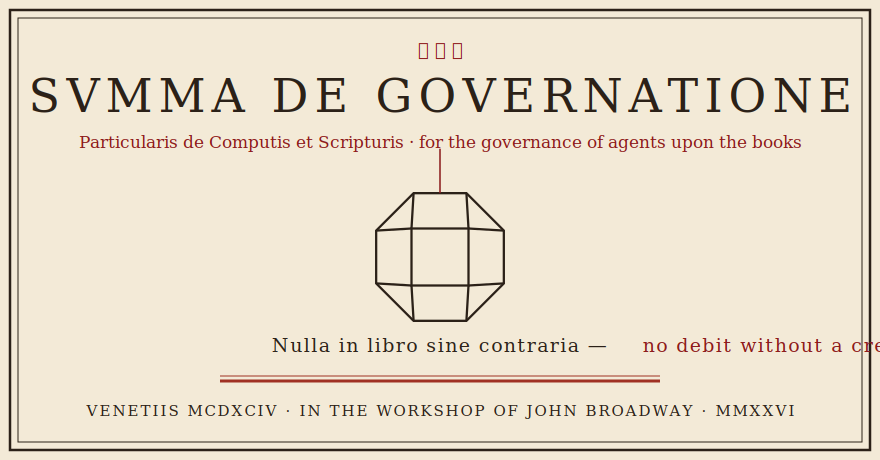

<div align="center">
  
</div>

**Least-privilege governance for ERPNext, and a governed agent front door built on top of it — MCP and A2A, one spine behind both. A door admits; it never decides.**

In 1494, in Venice, Luca Pacioli printed the *Summa de arithmetica* — and inside it, the
tract that taught the world double-entry bookkeeping. He wrote it down not because merchants
couldn't count, but because they couldn't **trust**. His rule is one sentence deep: **no debit
without a credit.** Every action gets an equal, opposite, recorded counterpart — and a book
that doesn't balance confesses on the spot. Five hundred years of *prove it or it didn't happen*.

This repo is that tract, written again for a new clerk. The merchant's problem hasn't changed;
the clerk has. He balanced books for merchants who couldn't watch every clerk. This balances
them for owners who can't watch every agent. Same problem, five centuries apart. Same fix.

<div align="center">
  
  <br/><em>Tavola I — The friar at his slate, attributed to Jacopo de' Barbari, 1495. The glass
  rhombicuboctahedron hangs at his left; the Summa sits under the dodecahedron at his right.
  This repo's device is that hanging solid.</em>
</div>


## Distinctio I — Of the Two Instruments


**There are two instruments in this house, and they compose — they do not couple.** The first
guards every credential on the site whether an agent is involved or not; the second is the one
governed door an agent may use. The first is the floor; the second stands on it and submits to
it. What follows is each instrument as the treatise would have it: what it is, what it refuses,
and how it is installed.

<br clear="left"/>

### The Guard — the counting-house door

*No one writes in the books but the appointed hand, and only in the books appointed to them.*

A Frappe/ERPNext **bench app** (distribution name `pacioli-guard` on PyPI; installs as the
`pacioli_guard` bench app). It binds any API credential — an integration, a
Zapier/n8n flow, a script, a vendor token, a cron job, an AI agent — to an allowlist of methods
(and, if granted, DocTypes), enforced at the credential layer through Frappe's public
`auth_hooks` extension point, deny-by-default. No core fork. It governs **every** credential on
the site, agent or not.

```bash
# from your bench directory: wheel into the bench env, then install the app
env/bin/pip install pacioli-guard
bench --site <your-site> install-app pacioli_guard
```

### The Broker — the governed front door

*The clerk may propose; only the merchant disposes.*

A standalone, pip-installable broker (`pip install pacioli`) that gives an AI agent a
governed way to touch ERPNext — through the door of your choosing: **MCP or A2A**, one spine
behind both. **51 governed doctypes, 265 tools** — the full submittable transaction surface of
an ERPNext company — every write through PLAN → CONSENT → execute → PROVE, deny-by-default
beyond that. The door admits; the spine decides.

```bash
pip install pacioli
```

### How the instruments compose

**Guard is the floor; the broker is one consumer that binds itself to it.** Guard scopes and
enforces *any* credential on the site — you don't need to run an agent to need it. The broker
is the agent-facing front door, and its own ERPNext credential must itself be
`pacioli_guard`-scoped to exactly the calls it makes (the governed doctypes and their
submit/cancel vectors — shipped as data lists the deploy kit applies). Without that scoping,
anything holding the broker's raw
credential can call ERPNext's REST API directly and bypass PLAN, CONSENT, and PROVE entirely —
so the broker's own README states that scoping as a hard precondition, not an optional
hardening step.

This is composition, not coupling: Guard is independently useful for any credential on a site,
agent or otherwise; the broker is the one piece that chooses to sit on top of it and honor the
same floor it enforces on everything else.


## Distinctio II — Of the Memorandum, the Journal, and the Ledger


**Double entry is not a metaphor here. It is the design.** The bookkeeping tract of the Summa
(*Particularis de Computis et Scripturis*) organizes a merchant's truth into three books, and
slice for slice they are this system. In his journal every entry named its debit with *per* and
its credit with *a* — nothing moved on one leg. Read the spread the way he ruled it:

<br clear="left"/>

| folio | *per* — his book (1494) | *a* — here |
|---|---|---|
| ¹ | The **memorandum** (*memoriale*) — every transaction written down first, roughly, before any formal entry | **PLAN** — `plan_submit` / `plan_cancel` write the memorandum: the projected GL and the risk flags, dated, bound to the draft. Nothing posts. |
| ² | The **journal** (*giornale*) — each entry rewritten in fixed form, its debit marked *per*, its credit marked *a* | **PROVE** — the hash-chained receipt book. The intent receipt is the *per*, the outcome the *a*; an intent with no outcome is a debit with no credit, and the trial balance surfaces it as an orphan. |
| ³ | The **ledger** (*quaderno*) — the book of account itself | **ERPNext's GL** — the broker never writes in it directly; every entry reaches the ledger through the journal's discipline. |

And the same law runs across every pillar — for every action, its recorded counterpart:

| folio | the action (*per*) | its recorded counterpart (*a*) |
|---|---|---|
| ⁴ | An agent wants to write | **PLAN** — the projected GL impact, written down *before* the act. The mirror entry precedes the entry. |
| ⁵ | A plan exists | **CONSENT** — a human mints the marker, out of band. Agent proposes, human disposes: two hands on every posting, never one. |
| ⁶ | The write fires | **PROVE** — an *intent* receipt before, an *outcome* receipt after. A write missing its outcome is an **orphan**, and it surfaces exactly the way an unbalanced trial balance does. |
| ⁷ | A posting stands | **UNDO** — ERPNext's own cancel/amend is double-entry: the reversal posts equal-and-opposite rows. Nothing erased, everything answered. |
| ⁸ | A credential exists | **Guard** — no capability without its explicit grant line. Deny-by-default is "no entry without authorization," applied at the credential layer. |

Same law at every layer: **nothing moves without its counterpart.** A plan without consent
doesn't post. A write without a receipt is flagged. A credential without a grant is refused.
The one system you *can't* trust is the one where an action can happen alone — unplanned,
unconsented, unreceipted. Everything Pacioli refuses is exactly that: the lone entry.

<div align="center">
  
  <br/><em>Tavola II — Vigintisex Basium Planum Vacuum: the same solid, drawn hollow by
  Leonardo da Vinci for Pacioli's</em> De divina proportione. <em>Leonardo illustrated Luca's
  book; the debt is repaid here.</em>
</div>


## Distinctio III — Of the Counting-House Door

His counsel, applied at the credential layer:

- **Two hands on every entry.** The clerk writes; the merchant grants. The consent marker is
  minted (`pacioli mint`) outside the agent's reach — no posting on one hand's authority.
- **The counting-house door.** No one writes in the books but the appointed hand, and only in
  the books appointed to them — that is Guard, per-credential and per-doctype, deny-by-default.
- **The registered book.** The books take their authority from a mark held outside the
  bookkeeper's own hand. `pacioli anchor` carries the receipt-book's head off the box — a
  registration the book cannot rewrite, so a truncated or swapped book confesses against it.


## Distinctio IV — Of the Closing of the Books

> ❧ *Do not go to sleep until the debits equal the credits.*

He gave merchants that rule, and it is the operating rule here too. `pacioli verify` is that
sleep test — run the trial balance, and if intent and outcome don't pair, the book itself
tells you.

**The closed books.** Closing the ledger is his own operation: rule off the book, carry the
balances forward. The broker refuses to write in a closed book — a closed Accounting Period, a
Period-Closing-Voucher boundary, a frozen-books date — and never slips a backdated or
future-dated entry past the ruling-off.


## Distinctio V — Of the Inventory


**Open no books before the survey.** He starts the merchant with a complete inventory before a
single entry — what you hold, what is owed, what is missing. `pacioli doctor` is that survey
for this house: what is reachable, what is granted, what refuses and why — and the road does
not proceed until the doctor says `ready.` The census (`pacioli close`) then keeps the
inventory honest for every period after: statement, reconciliation, response — every finding
accounted for, or the book says so out loud.

<br clear="left"/>


## Status

(Current versions live in each package's `pyproject.toml`/`CHANGELOG.md` — this README
deliberately does not restate them.)

Guard — deny-by-default credential scoping with the **deny-unknown** posture (an
unrecognized generic RPC is denied even if granted; per-doctype grants + three curated safe
methods are the whole surface), live-proven on a real Frappe v16 bench (Gates 1, 7, 10).

Broker — **51 governed doctypes, 265 tools; 38 of the 51 live-proven end-to-end** on a real
ERPNext v16 bench as a guard-scoped seat (Gates 2–10, envelopes E1–E8, and the 2026-07
live-prove sweep): governed submit/cancel/amend across accounts, stock, assets, manufacturing,
and subcontracting; Workflow-SoD consent; cascade cancel with dependent graphs (a 3-node Asset
graph under one consent, live); **governed Payment Reconciliation** (stricter than ERPNext
itself — the closed-books belt ERPNext skips for reconciliation, proven live, PHASE X); the
armed-Budget control-plane probe (arm → the bench refuses the PO → disarm → the same PO
passes, every step disclosed pre-consent); the off-box anchor; a certified least-privilege
reference seat; and the founding refusals (no debit without a credit — live). The whole arc is
written up leg-by-leg in [`SCOPED-TOKEN-PROOF.md`](./SCOPED-TOKEN-PROOF.md) (PHASES A–X). See
[`broker/README.md`](./broker/README.md#honest-scope) for exactly what ships and what doesn't.

## License

Apache-2.0.


<div align="center">
  

  <em>Here ends the Summa of Governance: printed upon the counsel of Fra Luca Pacioli,
  who taught that no entry stands alone; set in these types for the governance of agents
  upon the books.</em>

  <strong>VENETIIS MCDXCIV · IN THE WORKSHOP OF JOHN BROADWAY · MMXXVI</strong>
</div>
