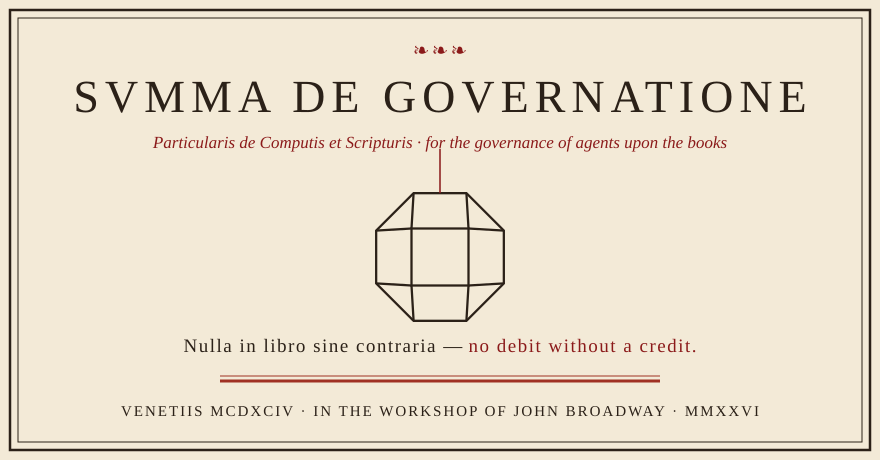

<div align="center">
  
</div>

**Least-privilege governance for ERPNext, and a governed agent front door built on top of it — MCP and A2A, one spine behind both. A door admits; it never decides.**

In 1494, in Venice, Luca Pacioli printed the *Summa de arithmetica* — and inside it, the
tract that taught the world double-entry bookkeeping. He wrote it down not because merchants
couldn't count, but because they couldn't **trust**. His rule is one sentence deep: **no debit
without a credit.** Every action gets an equal, opposite, recorded counterpart — and a book
that doesn't balance confesses on the spot. Five hundred years of *prove it or it didn't happen*.

This repo is that tract, written again for a new clerk. The merchant's problem hasn't changed;
the clerk has. He balanced books for merchants who couldn't watch every clerk. This balances
them for owners who can't watch every agent. Same problem, five centuries apart. Same fix.

<div align="center">
  
  <br/><em>Tavola I — The friar at his slate, attributed to Jacopo de' Barbari, 1495. The glass
  rhombicuboctahedron hangs at his left; the Summa sits under the dodecahedron at his right.
  This repo's device is that hanging solid.</em>
</div>


## Distinctio I — Of the Two Instruments


**There are two instruments in this house, and they compose — they do not couple.** The first
guards every **api-key** credential on the site whether an agent is involved or not; the second is
the one governed door an agent may use. The first is the floor under that door; the second stands
on it and submits to it. What follows is each instrument as the treatise would have it: what it is,
what it refuses, and how it is installed.

**What the floor covers, plainly, because a floor that overstates itself is not a floor.** Two
questions, two of frappe's own public hooks, each at the altitude where its question is legible.

*Which credential is acting, and what may it call?* The credential gate rides `auth_hooks`, which
runs when an api-key credential authenticates. It governs `token`/`Basic` api-key requests across
every REST mount, and it does **not** govern OAuth2 `Bearer` tokens, desk/cookie sessions,
background jobs, the scheduler, server scripts, or the bench console. "Which credential is this"
only exists at authentication time, so this gate can only live here, and that boundary is inherent
to it.

*Was this act consented?* That is a property of a document, so it is enforced on the document, via
`doc_events` on `before_submit` and `before_cancel`. Every path that **posts to the ledger** through
the ORM passes it: REST, `run_doc_method`, `frappe.client.submit`, `frappe.client.insert` with a
submitted body, the desk Save/Submit endpoint, bulk submit, a raw docstatus field write followed by a
save, a background job, a server script, and the bench console. **Consent does not inherit the credential gate's transport boundary.**

What still walks around **both**, stated up front rather than discovered later:

1. A write that skips the document lifecycle entirely: raw SQL, and `db_update`/`db_set`-style field
   writes. ERPNext core does this itself when reposting.
2. An actor who can break the grant read. The consent handler runs on every document on the site, so
   if reading the grant raises it returns rather than throwing — a wildcard handler that crashes
   takes the site with it. A deliberate trade, and a real residual.
3. **`Document.discard`.** It is whitelisted, so it is reachable, and it sets `docstatus = 2` with
   `db_set` while firing `before_discard` rather than `before_cancel`. It refuses anything that is
   not a draft, so **no ledger entry is ever reversed by it** and nothing posts — the exposure is a
   draft being taken out of play, not books moving. Gating it wants its own act type rather than
   being folded into "cancel", since consenting to reverse a posted entry and consenting to abandon
   a draft are different permissions. Named here rather than rounded off.

No single frappe extension point covers all of it, so coverage here is a composition with a stated
residual rather than a claim of totality, which is a thing the platform cannot give anyone.

<br clear="left"/>

### The Guard — the counting-house door

*No one writes in the books but the appointed hand, and only in the books appointed to them.*

A Frappe/ERPNext **bench app** (distribution name `pacioli-guard` on PyPI; installs as the
`pacioli_guard` bench app). It binds any API credential — an integration, a
Zapier/n8n flow, a script, a vendor token, a cron job, an AI agent — to an allowlist of methods
(and, if granted, DocTypes), enforced at the credential layer through Frappe's public
`auth_hooks` extension point, deny-by-default. No core fork. It governs **every api-key**
credential on the site, agent or not — see the coverage note above for what that does and does not
reach, and for the separate document-layer gate that carries consent.

```bash
# from your bench directory: wheel into the bench env, then install the app
env/bin/pip install pacioli-guard
bench --site <your-site> install-app pacioli_guard
```

### The Broker — hand it the books

*The clerk may propose; only the merchant disposes.*

A standalone, pip-installable broker (`pip install pacioli`) that gives an AI agent a
governed way to touch ERPNext — through the door of your choosing: **MCP or A2A**, one spine
behind both. **51 governed doctypes, 265 tools** — the full submittable transaction surface of
an ERPNext company — every write through PLAN → CONSENT → execute → PROVE, deny-by-default
beyond that. The door admits; the spine decides.

```bash
pip install pacioli
```

### How the instruments compose

**Guard is the floor; the broker is one consumer that binds itself to it.** Guard scopes and
enforces *any* credential on the site — you don't need to run an agent to need it. The broker
is the agent-facing front door, and its own ERPNext credential must itself be
`pacioli_guard`-scoped to exactly the calls it makes (the governed doctypes and their
submit/cancel vectors — shipped as data lists the deploy kit applies). Without that scoping,
anything holding the broker's raw
credential can call ERPNext's REST API directly and bypass PLAN, CONSENT, and PROVE entirely —
so the broker's own README states that scoping as a hard precondition, not an optional
hardening step.

**And scoping alone is not sufficient — this was proven against a live bench on 2026-07-25, and
it is worth stating plainly rather than leaving as an inference.** The broker must be allowed to
submit invoices, because submitting invoices is what the broker is *for*. So its credential is
allowed to submit invoices, and a direct `run_doc_method` call holding that credential submitted
one with no plan, no marker and no receipt. The ledger moved. The guard behaved exactly as
designed and the allowlist was exactly right: no allowlist can close this, because the call being
made is the call the broker exists to make. Possession of the key was permission to post.

The guard closes it at the floor rather than in the broker: `API Key Scope.require_consent`
(opt-in, off by default) refuses a docstatus-changing act unless it carries a live, single-use
`Pacioli Consent Marker` minted for that exact document **and that exact act**, and spends the
marker on use. Consent to post is not consent to reverse: cancel moves the same document and
writes the opposite GL entries, so a submit marker never spends on a cancel. And the marker must
be written by a **different principal** than the credential it authorises — the floor compares the
minter against the caller and refuses a match, because a credential that can mint its own consent
is a gate writing its own permission slip. `minted_by` is set by the server from the authenticated
session, overwriting anything the caller supplies, so that separation is established rather than
self-reported.

This gate is enforced on the **document**, not on the request: `doc_events` `before_submit` /
`before_cancel`. That is deliberate and it is the difference between governing one door and
governing the act. A credential holder who avoids the api-key REST path entirely, via an OAuth
token, a desk session, a background job, a server script or the bench console, **still meets this
gate**.

Meeting it and passing it are different things, and the difference is worth stating rather than
leaving to be discovered. A marker is presented in an HTTP header, so on a path that has no HTTP
request there is no way to present one: a consent-gated principal acting through a background job or
the bench console can only ever be **refused** there. That is fail-closed and it is the intended
posture, but do not read the paragraph above as "those paths work the same way" — they are covered
in the sense that they are stopped, not in the sense that they are usable.

Being opt-in has a consequence worth stating plainly: installing the app changes nothing by itself.
An install is exposed to the bypass above until someone turns `require_consent` on for the
credentials that matter.

This is composition, not coupling: Guard is independently useful, and not only for agents. Its two
halves have two different reaches, and the difference is the honest part — credential scope binds
any **api-key** credential (agent or otherwise) and sees nothing else, while the consent gate runs
at the document layer and covers every ORM path — desk sessions, background jobs, the scheduler,
server scripts, the bench console — for a credential you have gated. The broker is the one piece
that chooses to sit on top of it and honor the same floor it enforces on everything else.


## Distinctio II — Of the Memorandum, the Journal, and the Ledger


**Double entry is not a metaphor here. It is the design.** The bookkeeping tract of the Summa
(*Particularis de Computis et Scripturis*) organizes a merchant's truth into three books, and
slice for slice they are this system. In his journal every entry named its debit with *per* and
its credit with *a* — nothing moved on one leg. Read the spread the way he ruled it:

<br clear="left"/>

| folio | *per* — his book (1494) | *a* — here |
|---|---|---|
| ¹ | The **memorandum** (*memoriale*) — every transaction written down first, roughly, before any formal entry | **PLAN** — `plan_submit` / `plan_cancel` write the memorandum: the projected GL and the risk flags, dated, bound to the draft. Nothing posts. |
| ² | The **journal** (*giornale*) — each entry rewritten in fixed form, its debit marked *per*, its credit marked *a* | **PROVE** — the hash-chained receipt book. The intent receipt is the *per*, the outcome the *a*; an intent with no outcome is a debit with no credit, and the trial balance surfaces it as an orphan. |
| ³ | The **ledger** (*quaderno*) — the book of account itself | **ERPNext's GL** — the broker never writes in it directly; every entry reaches the ledger through the journal's discipline. |

And the same law runs across every pillar — for every action, its recorded counterpart:

| folio | the action (*per*) | its recorded counterpart (*a*) |
|---|---|---|
| ⁴ | An agent wants to write | **PLAN** — the projected GL impact, written down *before* the act. The mirror entry precedes the entry. |
| ⁵ | A plan exists | **CONSENT** — a human mints the marker, out of band. Agent proposes, human disposes: two hands on every posting, never one. |
| ⁶ | The write fires | **PROVE** — an *intent* receipt before, an *outcome* receipt after. A write missing its outcome is an **orphan**, and it surfaces exactly the way an unbalanced trial balance does. |
| ⁷ | A posting stands | **UNDO** — ERPNext's own cancel/amend is double-entry: the reversal posts equal-and-opposite rows. Nothing erased, everything answered. |
| ⁸ | A credential exists | **Guard** — no capability without its explicit grant line. Deny-by-default is "no entry without authorization," applied at the credential layer. |

Same law at every layer: **nothing moves without its counterpart.** A plan without consent
doesn't post. A write without a receipt is flagged. A credential without a grant is refused.
The one system you *can't* trust is the one where an action can happen alone — unplanned,
unconsented, unreceipted. Everything Pacioli refuses is exactly that: the lone entry.

<div align="center">
  
  <br/><em>Tavola II — Vigintisex Basium Planum Vacuum: the same solid, drawn hollow by
  Leonardo da Vinci for Pacioli's</em> De divina proportione. <em>Leonardo illustrated Luca's
  book; the debt is repaid here.</em>
</div>


## Distinctio III — Of the Counting-House Door

His counsel, applied at the credential layer:

- **Two hands on every entry.** The clerk writes; the merchant grants. The consent marker is
  minted (`pacioli mint`) outside the agent's reach — no posting on one hand's authority.
- **The counting-house door.** No one writes in the books but the appointed hand, and only in
  the books appointed to them — that is Guard, per-credential and per-doctype, deny-by-default.
- **The registered book.** The books take their authority from a mark held outside the
  bookkeeper's own hand. `pacioli anchor` carries the receipt-book's head off the box — a
  registration the book cannot rewrite, so a truncated or swapped book confesses against it.


## Distinctio IV — Of the Closing of the Books

> ❧ *Do not go to sleep until the debits equal the credits.*

He gave merchants that rule, and it is the operating rule here too. `pacioli verify` is that
sleep test — run the trial balance, and if intent and outcome don't pair, the book itself
tells you.

**The closed books.** Closing the ledger is his own operation: rule off the book, carry the
balances forward. The broker refuses to write in a closed book — a closed Accounting Period, a
Period-Closing-Voucher boundary, a frozen-books date — and never slips a backdated or
future-dated entry past the ruling-off.


## Distinctio V — Of the Inventory


**Open no books before the survey.** He starts the merchant with a complete inventory before a
single entry — what you hold, what is owed, what is missing. `pacioli doctor` is that survey
for this house: what is reachable, what is granted, what refuses and why — and the road does
not proceed until the doctor says `ready.` The census (`pacioli close`) then keeps the
inventory honest for every period after: statement, reconciliation, response — every finding
accounted for, or the book says so out loud.

<br clear="left"/>


## Status

(Current versions live in each package's `pyproject.toml`/`CHANGELOG.md` — this README
deliberately does not restate them.)

Guard — deny-by-default credential scoping with the **deny-unknown** posture (an
unrecognized generic RPC is denied even if granted; per-doctype grants + four curated safe
methods are the whole surface), live-proven on a real Frappe v16 bench (Gates 1, 7, 10).

Broker — **51 governed doctypes, 265 tools; 48 of the 51 live-proven end-to-end** on a real
ERPNext v16 bench as a guard-scoped seat (Gates 2–10, envelopes E1–E8, and the 2026-07
live-prove sweep): governed submit/cancel/amend across accounts, stock, assets, manufacturing,
and subcontracting; Workflow-SoD consent; cascade cancel with dependent graphs (a 3-node Asset
graph under one consent, live); **governed Payment Reconciliation** (stricter than ERPNext
itself — the closed-books belt ERPNext skips for reconciliation, proven live, PHASE X); the
armed-Budget control-plane probe (arm → the bench refuses the PO → disarm → the same PO
passes, every step disclosed pre-consent); the off-box anchor; a certified least-privilege
reference seat; and the founding refusals (no debit without a credit — live). The whole arc is
written up leg-by-leg in [`SCOPED-TOKEN-PROOF.md`](./SCOPED-TOKEN-PROOF.md) (PHASES A–X). See
[`broker/README.md`](./broker/README.md#honest-scope) for exactly what ships and what doesn't.

## License

Apache-2.0.


<div align="center">
  

  <em>Here ends the Summa of Governance: printed upon the counsel of Fra Luca Pacioli,
  who taught that no entry stands alone; set in these types for the governance of agents
  upon the books.</em>

  <strong>VENETIIS MCDXCIV · IN THE WORKSHOP OF JOHN BROADWAY · MMXXVI</strong>
</div>
